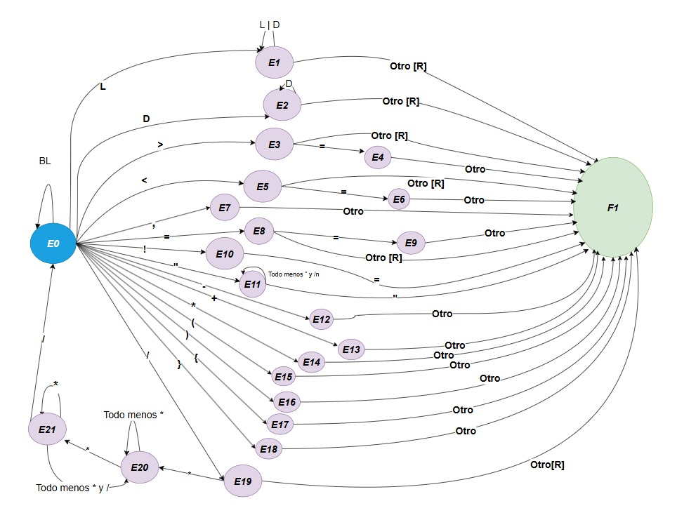

<<<<<<< HEAD
# Spec — Analizador léxico de UNO

**Grupo:** ejemplo de cátedra · **Lenguaje de implementación:** C
**Depende de:** `specs/01-diseno/spec.md`
**Produce:** `src/lexico/` · escribe en la tabla de símbolos definida en `specs/02-tabla-simbolos/spec.md`

---

## 1. Alcance e interfaz

Función `yylex()` invocada por el analizador sintáctico. Devuelve **un token por
llamada**, como entero asociado al número de token. No es una pasada previa que
produzca la lista completa.

## 2. Decisiones propias de esta fase

| # | Decisión | Valor |
|---|---|---|

---

## 3. Eventos (columnas de las matrices)

`get_evento(c)` mapea el carácter leído a una columna:

| Col | Evento | Caracteres |
|---|---|---|

---

## 4. Estados y Diagrama

| Estado | Token devuelto |
|---|---|
| E1 | ID o palabra reservada |
| E2 | CTE |
| E3 | MAYOR |
| E4 | MAYOR_E |
| E5 | MENOR |
| E6 | MENOR_E |
| E7 | COMA|
| E8 | ASIG |
| E9 | IGUAL
| E10 | DISTINTO |
| E11 | CADENA |
| E12 | MENOS |
| E13 | MAS |
| E14 | MULTIPLICAR |
| E15 | PARENTESIS_I |
| E16 | PARENTESIS_D |
| E17 | LLAVE_I |
| E18 | LLAVE_D |
| E19 | DIV |

# Automata

---

## 5. Matriz de Nuevos Estados

| Estado actual | L | D | BL | > | < | = | ! | " | / | * | + | - | ( | ) | { | } | ; | , | EOF | No reconocido |
|---|---|---|---|---|---|---|---|---|---|---|---|---|---|---|---|---|---|---|---|---|
| 0 | e1 | e2 | e0 | e3 | e5 | e8 | e10 | e11 | e19 | e14 | e13 | e12 | e15 | e16 | e17 | e18 | e22 | e7 | -1 | ERR | 
| 1 (ID) | e1 | e1 | -1 | -1 | -1 | -1 | -1 | -1 | -1 | -1 | -1 | -1 | -1 | -1 | -1 | -1 | -1 | -1 | -1 | -1 |
| 2 (CTE) | -1 | e2 | -1 | -1 | -1 | -1 | -1 | -1 | -1 | -1 | -1 | -1 | -1 | -1 | -1 | -1 | -1 | -1 | -1 | -1 |
| 3 (>) | -1 | -1 | -1 | -1 | -1 | e4 | -1 | -1 | -1 | -1 | -1 | -1 | -1 | -1 | -1 | -1 | -1 | -1 | -1 | -1 |
| 4 (>=) | -1 | -1 | -1 | -1 | -1 | -1 | -1 | -1 | -1 | -1 | -1 | -1 | -1 | -1 | -1 | -1 | -1 | -1 | -1 | -1 |
| 5 (<) | -1 | -1 | -1 | -1 | -1 | e6 | -1 | -1 | -1 | -1 | -1 | -1 | -1 | -1 | -1 | -1 | -1 | -1 | -1 | -1 |
| 6 (<=) | -1 | -1 | -1 | -1 | -1 | -1 | -1 | -1 | -1 | -1 | -1 | -1 | -1 | -1 | -1 | -1 | -1 | -1 | -1 | -1 |
| 7 (,) | -1 | -1 | -1 | -1 | -1 | -1 | -1 | -1 | -1 | -1 | -1 | -1 | -1 | -1 | -1 | -1 | -1 | -1 | -1 | -1 |
| 8 (=) | -1 | -1 | -1 | -1 | -1 | e9 | -1 | -1 | -1 | -1 | -1 | -1 | -1 | -1 | -1 | -1 | -1 | -1 | -1 | -1 |
| 9 (==) | -1 | -1 | -1 | -1 | -1 | -1 | -1 | -1 | -1 | -1 | -1 | -1 | -1 | -1 | -1 | -1 | -1 | -1 | -1 | -1 |
| 10 (!) | ERR | ERR | ERR | ERR | ERR | -1 | ERR | ERR | ERR | ERR | ERR | ERR | ERR | ERR | ERR | ERR | ERR | ERR | ERR | ERR | 
| 11 (") | e11 | e11 | e11 | e11 | e11 | e11 | e11 | -1 | e11 | e11 | e11 | e11 | e11 | e11 | e11 | e11 | e11 | e11 | ERR | e11 |
| 12 (-) | -1 | -1 | -1 | -1 | -1 | -1 | -1 | -1 | -1 | -1 | -1 | -1 | -1 | -1 | -1 | -1 | -1 | -1 | -1 | -1 |
| 13 (+) | -1 | -1 | -1 | -1 | -1 | -1 | -1 | -1 | -1 | -1 | -1 | -1 | -1 | -1 | -1 | -1 | -1 | -1 | -1 | -1 |
| 14 (*) | -1 | -1 | -1 | -1 | -1 | -1 | -1 | -1 | -1 | -1 | -1 | -1 | -1 | -1 | -1 | -1 | -1 | -1 | -1 | -1 |
| 15 (PARENTESIS_I) | -1 | -1 | -1 | -1 | -1 | -1 | -1 | -1 | -1 | -1 | -1 | -1 | -1 | -1 | -1 | -1 | -1 | -1 | -1 | -1 |
| 16 (PARENTESIS_D) | -1 | -1 | -1 | -1 | -1 | -1 | -1 | -1 | -1 | -1 | -1 | -1 | -1 | -1 | -1 | -1 | -1 | -1 | -1 | -1 |
| 17 (LLAVE_I) | -1 | -1 | -1 | -1 | -1 | -1 | -1 | -1 | -1 | -1 | -1 | -1 | -1 | -1 | -1 | -1 | -1 | -1 | -1 | -1 |
| 18 (LLAVE_D) | -1 | -1 | -1 | -1 | -1 | -1 | -1 | -1 | -1 | -1 | -1 | -1 | -1 | -1 | -1 | -1 | -1 | -1 | -1 | -1 |
| 19 (/) | -1 | -1 | -1 | -1 | -1 | -1 | -1 | -1 | -1 | e20 | -1 | -1 | -1 | -1 | -1 | -1 | -1 | -1 | -1 | -1 |
| 20 (*) | e20  | e20  | e20  | e20  | e20  | e20  | e20  | e20 | e20 | e21 | e20 | e20 | e20 | e20 | e20 | e20 | e20 | e20 | ERR | e20 | 
| 21 (/) | e20 | e20 | e20 | e20 | e20 | e20 | e20 | e20 | e0 | e21 | e20 | e20 | e20 | e20 | e20 | e20 | e20 | e20 | ERR | e20 | 
| 22 (;) | -1 | -1 | -1 | -1 | -1 | -1 | -1 | -1 | -1 | -1 | -1 | -1 | -1 | -1 | -1 | -1 | -1 | -1 | -1 | -1 |

---

## 6. Acciones semánticas

| Acción | Qué hace|
|---|---|
| f1 | Inicia un string | 
| f2 | Inicia una constante |
| f3 | Incrementa el contador de longitud. Si se excedió el largo máximo termina |
| f4 | Verifica si el string está en la lista de palabras reservadas (ej: int, if, main). Si está devuelve su token. Si no está, lo agrega como ID. |
| f5 | Verifica si la CTE ya esta almacenada, si no esta la guarda en la tabla de símbolos con su valor real |
| F6 | Calcula el nuevo valor numérico acumulado carácter por carácter |
| f7 | Agrega el caracter al string del literal de texto |
| f_err | Reporta un error lexico |
| fn | No hace nada |

---

## 7. Matriz de Transiciones

| Estado actual | L | D | BL | > | < | = | ! | " | / | * | + | - | ( | ) | { | } | ; | , | EOF | No reconocido |
|---|---|---|---|---|---|---|---|---|---|---|---|---|---|---|---|---|---|---|---|---|
| 0 | e1-f1 | e2-f2 | e0-fn | e3-fn | e5-fn | e8-fn | e10-fn | e11-f1 | e19-fn | e14-fn | e13-fn |  e12-fn | e15-fn | e16-fn | e17-fn | e18-fn | e22-fn | e7-fn | F-fn | ERR-ferr | 
| 1 (ID) | e1-f3 | e1-f3 | FU-f4 | FU-f4 | FU-f4 | FU-f4 | FU-f4 | FU-f4 | FU-f4 | FU-f4 | FU-f4 | FU-f4 | FU-f4 | FU-f4 | FU-f4 | FU-f4 | FU-f4 | FU-f4 | FU-f4 | FU-f4 |
| 2 (CTE) | FU-f5 | e2-f6 | FU-f5 | FU-f5 | FU-f5 | FU-f5 | FU-f5 | FU-f5 | FU-f5 | FU-f5 | FU-f5 | FU-f5 | FU-f5 | FU-f5 | FU-f5 | FU-f5 | FU-f5 | FU-f5 | FU-f5 | FU-f5 | 
| 3 (>) | FU-fn | FU-fn | FU-fn | FU-fn | FU-fn | e4-fn | FU-fn | FU-fn | FU-fn | FU-fn | FU-fn | FU-fn | FU-fn | FU-fn | FU-fn | FU-fn | FU-fn | FU-fn | FU-fn | FU-fn |
| 4 (>=) | FU-fn | FU-fn | FU-fn | FU-fn | FU-fn | FU-fn | FU-fn | FU-fn | FU-fn | FU-fn | FU-fn | FU-fn | FU-fn | FU-fn | FU-fn | FU-fn | FU-fn | FU-fn | FU-fn | FU-fn |
| 5 (<) | FU-fn | FU-fn | FU-fn | FU-fn | FU-fn | e6-fn | FU-fn | FU-fn | FU-fn | FU-fn | FU-fn | FU-fn | FU-fn | FU-fn | FU-fn | FU-fn | FU-fn | FU-fn | FU-fn | FU-fn |
| 6 (<=) | FU-fn | FU-fn | FU-fn | FU-fn | FU-fn | FU-fn | FU-fn | FU-fn | FU-fn | FU-fn | FU-fn | FU-fn | FU-fn | FU-fn | FU-fn | FU-fn | FU-fn | FU-fn | FU-fn | FU-fn |
| 7 (,) | FU-fn | Fu-fn | Fu-fn | Fu-fn | Fu-fn | Fu-fn | Fu-fn | Fu-fn | Fu-fn | Fu-fn | Fu-fn | Fu-fn | Fu-fn | Fu-fn | Fu-fn | Fu-fn | Fu-fn | Fu-fn | Fu-fn | Fu-fn |
| 8 (=) | FU-fn | FU-fn | FU-fn | FU-fn | FU-fn | e9-fn | FU-fn | FU-fn | FU-fn | FU-fn | FU-fn | FU-fn | FU-fn | FU-fn | FU-fn | FU-fn | FU-fn | FU-fn | FU-fn | FU-fn |
| 9 (==) | FU-fn | FU-fn | FU-fn | FU-fn | FU-fn | FU-fn | FU-fn | FU-fn | FU-fn | FU-fn | FU-fn | FU-fn | FU-fn | FU-fn | FU-fn | FU-fn | FU-fn | FU-fn | FU-fn | FU-fn |
| 10 (!) | ERR-f_err | ERR | ERR | ERR | ERR | f-fn | ERR | ERR | ERR | ERR | ERR | ERR | ERR | ERR | ERR | ERR | ERR | ERR | ERR | ERR | 
| 11 (") | e11-f7 | e11-f7 | e11-f7 | e11-f7 | e11-f7 | e11-f7 | e11-f7 | F-fn | e11-f7 | e11-f7 | e11-f7 | e11-f7 | e11-f7 | e11-f7 | e11-f7 | e11-f7 | e11-f7 | e11-f7 | ERR | e11-f7 | 
| 12 (-) | Fu-fn | Fu-fn | Fu-fn | Fu-fn | Fu-fn | Fu-fn | Fu-fn | Fu-fn | Fu-fn | Fu-fn | Fu-fn | Fu-fn | Fu-fn | Fu-fn | Fu-fn | Fu-fn | Fu-fn | Fu-fn | Fu-fn | Fu-fn |
| 13 (+) | FU-fn | FU-fn | FU-fn | FU-fn | FU-fn | FU-fn | FU-fn | FU-fn | FU-fn | FU-fn | FU-fn | FU-fn | FU-fn | FU-fn | FU-fn | FU-fn | FU-fn | FU-fn | FU-fn | FU-fn |
| 14 (*) | FU-fn | FU-fn | FU-fn | FU-fn | FU-fn | FU-fn | FU-fn | FU-fn | FU-fn | FU-fn | FU-fn | FU-fn | FU-fn | FU-fn | FU-fn | FU-fn | FU-fn | FU-fn | FU-fn | FU-fn |
| 15 (PARENTESIS_I) | FU-fn | FU-fn | FU-fn | FU-fn | FU-fn | FU-fn | FU-fn | FU-fn | FU-fn | FU-fn | FU-fn | FU-fn | FU-fn | FU-fn | FU-fn | FU-fn | FU-fn | FU-fn | FU-fn | FU-fn |
| 16 (PARENTESIS_D) | FU-fn | FU-fn | FU-fn | FU-fn | FU-fn | FU-fn | FU-fn | FU-fn | FU-fn | FU-fn | FU-fn | FU-fn | FU-fn | FU-fn | FU-fn | FU-fn | FU-fn | FU-fn | FU-fn | FU-fn |
| 17 (LLAVE_I) | FU-fn | FU-fn | FU-fn | FU-fn | FU-fn | FU-fn | FU-fn | FU-fn | FU-fn | FU-fn | FU-fn | FU-fn | FU-fn | FU-fn | FU-fn | FU-fn | FU-fn | FU-fn | FU-fn | FU-fn |
| 18 (LLAVE_D) | FU-fn | FU-fn | FU-fn | FU-fn | FU-fn | FU-fn | FU-fn | FU-fn | FU-fn | FU-fn | FU-fn | FU-fn | FU-fn | FU-fn | FU-fn | FU-fn | FU-fn | FU-fn | FU-fn | FU-fn |
| 19 (/) | FU-fn | FU-fn | FU-fn | FU-fn | FU-fn | FU-fn | FU-fn | FU-fn | FU-fn | e20-fn | FU-fn | FU-fn | FU-fn | FU-fn | FU-fn | FU-fn | FU-fn | FU-fn | FU-fn | FU-fn |
| 20 (*) | e20-fn  | e20-fn  | e20-fn  | e20-fn  | e20-fn  | e20-fn  | e20-fn  | e20-fn | e20-fn | e21-fn | e20-fn | e20-fn | e20-fn | e20-fn | e20-fn | e20-fn | e20-fn | ERR | e20-fn | 
| 21 (/) | e20-fn | e20-fn | e20-fn | e20-fn | e20-fn | e20-fn | e20-fn | e20-fn | e0-fn | e21-fn | e20-fn | e20-fn | e20-fn | e20-fn | e20-fn | e20-fn | e20-fn | e20-fn | ERR | e20-fn |  
| 22 (;) | FU-fn | FU-fn | FU-fn | FU-fn | FU-fn | FU-fn | FU-fn | FU-fn | FU-fn | FU-fn | FU-fn | FU-fn | FU-fn | FU-fn | FU-fn | FU-fn | FU-fn | FU-fn | FU-fn | FU-fn |
---

## 8. Tabla de Unreads

`unreads [24][21]=`

| Estado actual | L | D | BL | > | < | = | ! | " | / | * | + | - | ( | ) | { | } | ; | , | EOF | No reconocido |
|---|---|---|---|---|---|---|---|---|---|---|---|---|---|---|---|---|---|---|---|---|
| 0 | 0 | 0 | 0 | 0 | 0 | 0 | 0 | 0 | 0 | 0 | 0 | 0 | 0 | 0 | 0 | 0 | 0 | 0 | 0 | 0 | 
| 1 (ID) | 0 | 0 | 1 | 1 | 1 | 1 | 1 | 1 | 1 | 1 | 1 | 1 | 1 | 1 | 1 | 1 | 1 | 1 | 1 | 1 |
| 2 (CTE) | 1 | 0 | 1 | 1 | 1 | 1 | 1 | 1 | 1 | 1 | 1 | 1 | 1 | 1 | 1 | 1 | 1 | 1 | 1 | 1 |
| 3 (>) | 1 | 1 | 1 | 1 | 1 | 0 | 1 | 1 | 1 | 1 | 1 | 1 | 1 | 1 | 1 | 1 | 1 | 1 | 1 | 1 |
| 4 (>=) | 1 | 1 | 1 | 1 | 1 | 1 | 1 | 1 | 1 | 1 | 1 | 1 | 1 | 1 | 1 | 1 | 1 | 1 | 1 | 1 |
| 5 (<) | 1 | 1 | 1 | 1 | 1 | 0 | 1 | 1 | 1 | 1 | 1 | 1 | 1 | 1 | 1 | 1 | 1 | 1 | 1 | 1 |
| 6 (>=) | 1 | 1 | 1 | 1 | 1 | 1 | 1 | 1 | 1 | 1 | 1 | 1 | 1 | 1 | 1 | 1 | 1 | 1 | 1 | 1 |
| 7 (,) | 1 | 1 | 1 | 1 | 1 | 1 | 1 | 1 | 1 | 1 | 1 | 1 | 1 | 1 | 1 | 1 | 1 | 1 | 1 | 1 |
| 8 (=) | 1 | 1 | 1 | 1 | 1 | 0 | 1 | 1 | 1 | 1 | 1 | 1 | 1 | 1 | 1 | 1 | 1 | 1 | 1 | 1 |
| 9 (==) | 1 | 1 | 1 | 1 | 1 | 1 | 1 | 1 | 1 | 1 | 1 | 1 | 1 | 1 | 1 | 1 | 1 | 1 | 1 | 1 |
| 10 (!) | 0 | 0 | 0 | 0 | 0 | 0 | 0 | 0 | 0 | 0 | 0 | 0 | 0 | 0 | 0 | 0 | 0 | 0 | 0 | 0 | 
| 11 (") | 0 | 0 | 0 | 0 | 0 | 0 | 0 | 0 | 0 | 0 | 0 | 0 | 0 | 0 | 0 | 0 | 0 | 0 | 0 | 0 |
| 12 (-) | 1 | 1 | 1 | 1 | 1 | 1 | 1 | 1 | 1 | 1 | 1 | 1 | 1 | 1 | 1 | 1 | 1 | 1 | 1 | 1 | 
| 13 (+) | 1 | 1 | 1 | 1 | 1 | 1 | 1 | 1 | 1 | 1 | 1 | 1 | 1 | 1 | 1 | 1 | 1 | 1 | 1 | 1 |
| 14 (*) | 1 | 1 | 1 | 1 | 1 | 1 | 1 | 1 | 1 | 1 | 1 | 1 | 1 | 1 | 1 | 1 | 1 | 1 | 1 | 1 |
| 15 (PARENTESIS_I) | 1 | 1 | 1 | 1 | 1 | 1 | 1 | 1 | 1 | 1 | 1 | 1 | 1 | 1 | 1 | 1 | 1 | 1 | 1 | 1 |
| 16 (PARENTESIS_D) | 1 | 1 | 1 | 1 | 1 | 1 | 1 | 1 | 1 | 1 | 1 | 1 | 1 | 1 | 1 | 1 | 1 | 1 | 1 | 1 |
| 17 (LLAVE_I) | 1 | 1 | 1 | 1 | 1 | 1 | 1 | 1 | 1 | 1 | 1 | 1 | 1 | 1 | 1 | 1 | 1 | 1 | 1 | 1 |
| 18 (LLAVE_D) | 1 | 1 | 1 | 1 | 1 | 1 | 1 | 1 | 1 | 1 | 1 | 1 | 1 | 1 | 1 | 1 | 1 | 1 | 1 | 1 |
| 19 (/) | 1 | 1 | 1 | 1 | 1 | 1 | 1 | 1 | 1 | 0 | 1 | 1 | 1 | 1 | 1 | 1 | 1 | 1 | 1 | 1 |
| 20 (*) | 0 | 0 | 0 | 0 | 0 | 0 | 0 | 0 | 0 | 0 | 0 | 0 | 0 | 0 | 0 | 0 | 0 | 0 | 0 | 0 |
| 21 (/) | 0 | 0 | 0 | 0 | 0 | 0 | 0 | 0 | 0 | 0 | 0 | 0 | 0 | 0 | 0 | 0 | 0 | 0 | 0 | 0 |
| 22 (;) | 1 | 1 | 1 | 1 | 1 | 1 | 1 | 1 | 1 | 1 | 1 | 1 | 1 | 1 | 1 | 1 | 1 | 1 | 1 | 1 |

---

## 9. Matriz Tokens

`tokens [24][21]=`

| Estado actual | L | D | BL | > | < | = | ! | " | / | * | + | - | ( | ) | { | } | ; | , | EOF | No reconocido |
|---|---|---|---|---|---|---|---|---|---|---|---|---|---|---|---|---|---|---|---|---|
| 0 | -1 | -1 | -1 | -1 | -1 | -1 | -1 | -1 | -1 | -1 | -1 | -1 | -1 | -1 | -1 | -1 | -1 | -1 | - | -1 |
| 1 (ID) | -1 | -1 | 256 | 256 | 256 | 256 | 256 | 256 | 256 | 256 | 256 | 256 | 256 | 256 | 256 | 256 | 256 | 256 | 256 | 256 |
| 2 (CTE) | 257 | -1 | 257 | 257 | 257 | 257 | 257 | 257 | 257 | 257 | 257 | 257 | 257 | 257 | 257 | 257 | 257 | 257 | 257 | 257 |
| 3 (>) | 271 | 271 | 271 | 271 | 271 | 274 | 271 | 271 | 271 | 271 | 271 | 271 | 271 | 271 | 271 | 271 | 271 | 271 | 271 | 271 |
| 4 (>=) | 274 | 274 | 274 | 274 | 274 | 274 | 274 | 274 | 274 | 274 | 274 | 274 | 274 | 274 | 274 | 274 | 274 | 274 | 274 | 274 |
| 5 (<) | 272 | 272 | 272 | 272 | 272 | 272 | 273 | 272 | 272 | 272 | 272 | 272 | 272 | 272 | 272 | 272 | 272 | 272 | 272 | 272 |
| 6 (>=) | 273 | 273 | 273 | 273 | 273 | 273 | 273 | 273 | 273 | 273 | 273 | 273 | 273 | 273 | 273 | 273 | 273 | 273 | 273 | 273 |
| 7 (,) | 285 | 285 | 285 | 285 | 285 | 285 | 285 | 285 | 285 | 285 | 285 | 285 | 285 | 285 | 285 | 285 | 285 | 285 | 285 | 285 |
| 8 (=) | 269 | 269 | 269 | 269 | 269 | 269 | 270 | 269 | 269 | 269 | 269 | 269 | 269 | 269 | 269 | 269 | 269 | 269 | 269 | 269 |
| 9 (==) | 270 | 270 | 270 | 270 | 270 | 270 | 270 | 270 | 270 | 270 | 270 | 270 | 270 | 270 | 270 | 270 | 270 | 270 | 270 | 270 |
| 10 (!) | -1 | -1 | -1 | -1 | -1 | 275 | -1 | -1 | -1 | -1 | -1 | -1 | -1 | -1 | -1 | -1 | -1 | -1 | -1 | -1 |
| 11 (") | -1 | -1 | -1 | -1 | -1 | -1 | -1 | 259 | -1 | -1 | -1 | -1 | -1 | -1 | -1 | -1 | -1 | -1 | -1 | -1 |
| 12 (-) | 277 | 277 | 277 | 277 | 277 | 277 | 277 | 277 | 277 | 277 | 277 | 277 | 277 | 277 | 277 | 277 | 277 | 277 | 277 | 277 |
| 13 (+) | 276 | 276 | 276 | 276 | 276 | 276 | 276 | 276 | 276 | 276 | 276 | 276 | 276 | 276 | 276 | 276 | 276 | 276 | 276 | 276 |
| 14 (*) | 278 | 278 | 278 | 278 | 278 | 278 | 278 | 278 | 278 | 278 | 278 | 278 | 278 | 278 | 278 | 278 | 278 | 278 | 278 | 278 |
| 15 (PARENTESIS_I) | 280 | 280 | 280 | 280 | 280 | 280 | 280 | 280 | 280 | 280 | 280 | 280 | 280 | 280 | 280 | 280 | 280 | 280 | 280 | 280 |
| 16 (PARENTESIS_D) | 281 | 281 | 281 | 281 | 281 | 281 | 281 | 281 | 281 | 281 | 281 | 281 | 281 | 281 | 281 | 281 | 281 | 281 | 281 | 281 |
| 17 (LLAVE_I) | 282 | 282 | 282 | 282 | 282 | 282 | 282 | 282 | 282 | 282 | 282 | 282 | 282 | 282 | 282 | 282 | 282 | 282 | 282 | 282 |
| 18 (LLAVE_D) | 283 | 283 | 283 | 283 | 283 | 283 | 283 | 283 | 283 | 283 | 283 | 283 | 283 | 283 | 283 | 283 | 283 | 283 | 283 | 283 |
| 19 (/) | 279 | 279 | 279 | 279 | 279 | 279 | 279 | 279 | 279 | -1 | 279 | 279 | 279 | 279 | 279 | 279 | 279 | 279 | 279 | 279 |
| 20 (*) | -1 | -1 | -1 | -1 | -1 | -1 | -1 | -1 | -1 | -1 | -1 | -1 | -1 | -1 | -1 | -1 | -1 | -1 | -1 | -1 |
| 21 (/) | -1 | -1 | -1 | -1 | -1 | -1 | -1 | -1 | -1 | -1 | -1 | -1 | -1 | -1 | -1 | -1 | -1 | -1 | -1 | -1 |
| 22 (;) | 284 | 284 | 284 | 284 | 284 | 284 | 284 | 284 | 284 | 284 | 284 | 284 | 284 | 284 | 284 | 284 | 284 | 284 | 284 | 284 |

---

## 9. Errores que emite esta fase

| Código | Condición | Mensaje |
|---|---|---|

---

## 10. Traza de verificación

Entrada ``, con el estado inicial 0:

| Estado | Lee | Evento | Acción | Nuevo estado | Unread | Retorna |
|---|---|---|---|---|---|---|

---

## 11. Casos de prueba de esta fase

| Entrada | Salida esperada | Qué verifica |
|---|---|---|
=======
# Spec — Analizador léxico de UNO

**Grupo:** ejemplo de cátedra · **Lenguaje de implementación:** C
**Depende de:** `specs/01-diseno/spec.md`
**Produce:** `src/lexico/` · escribe en la tabla de símbolos definida en `specs/02-tabla-simbolos/spec.md`

---

## 1. Alcance e interfaz

Función `yylex()` invocada por el analizador sintáctico. Devuelve **un token por
llamada**, como entero asociado al número de token. No es una pasada previa que
produzca la lista completa.

## 2. Decisiones propias de esta fase

| # | Decisión | Valor |
|---|---|---|

---

## 3. Eventos (columnas de las matrices)

`get_evento(c)` mapea el carácter leído a una columna:

| Col | Evento | Caracteres |
|---|---|---|

---

## 4. Estados y Diagrama

| Estado | Token devuelto |
|---|---|
| E1 | ID o palabra reservada |
| E2 | CTE |
| E3 | MAYOR |
| E4 | MAYOR_E |
| E5 | MENOR |
| E6 | MENOR_E |
| E7 | COMA|
| E8 | ASIG |
| E9 | IGUAL
| E10 | DISTINTO |
| E11 | CADENA |
| E12 | MENOS |
| E13 | MAS |
| E14 | MULTIPLICAR |
| E15 | PARENTESIS_I |
| E16 | PARENTESIS_D |
| E17 | LLAVE_I |
| E18 | LLAVE_D |
| E19 | DIV |

# Automata

---

## 5. Matriz de Nuevos Estados

| Estado actual | L | D | BL | > | < | = | ! | " | / | * | + | - | ( | ) | { | } | ; | , | EOF | No reconocido |
|---|---|---|---|---|---|---|---|---|---|---|---|---|---|---|---|---|---|---|---|---|
| 0 | e1 | e2 | e0 | e3 | e5 | e8 | e10 | e11 | e19 | e14 | e13 | e12 | e15 | e16 | e17 | e18 | e22 | e7 | -1 | ERR | 
| 1 (ID) | e1 | e1 | -1 | -1 | -1 | -1 | -1 | -1 | -1 | -1 | -1 | -1 | -1 | -1 | -1 | -1 | -1 | -1 | -1 | -1 |
| 2 (CTE) | -1 | e2 | -1 | -1 | -1 | -1 | -1 | -1 | -1 | -1 | -1 | -1 | -1 | -1 | -1 | -1 | -1 | -1 | -1 | -1 |
| 3 (>) | -1 | -1 | -1 | -1 | -1 | e4 | -1 | -1 | -1 | -1 | -1 | -1 | -1 | -1 | -1 | -1 | -1 | -1 | -1 | -1 |
| 4 (>=) | -1 | -1 | -1 | -1 | -1 | -1 | -1 | -1 | -1 | -1 | -1 | -1 | -1 | -1 | -1 | -1 | -1 | -1 | -1 | -1 |
| 5 (<) | -1 | -1 | -1 | -1 | -1 | e6 | -1 | -1 | -1 | -1 | -1 | -1 | -1 | -1 | -1 | -1 | -1 | -1 | -1 | -1 |
| 6 (<=) | -1 | -1 | -1 | -1 | -1 | -1 | -1 | -1 | -1 | -1 | -1 | -1 | -1 | -1 | -1 | -1 | -1 | -1 | -1 | -1 |
| 7 (,) | -1 | -1 | -1 | -1 | -1 | -1 | -1 | -1 | -1 | -1 | -1 | -1 | -1 | -1 | -1 | -1 | -1 | -1 | -1 | -1 |
| 8 (=) | -1 | -1 | -1 | -1 | -1 | e9 | -1 | -1 | -1 | -1 | -1 | -1 | -1 | -1 | -1 | -1 | -1 | -1 | -1 | -1 |
| 9 (==) | -1 | -1 | -1 | -1 | -1 | -1 | -1 | -1 | -1 | -1 | -1 | -1 | -1 | -1 | -1 | -1 | -1 | -1 | -1 | -1 |
| 10 (!) | ERR | ERR | ERR | ERR | ERR | -1 | ERR | ERR | ERR | ERR | ERR | ERR | ERR | ERR | ERR | ERR | ERR | ERR | ERR | ERR | 
| 11 (") | e11 | e11 | e11 | e11 | e11 | e11 | e11 | -1 | e11 | e11 | e11 | e11 | e11 | e11 | e11 | e11 | e11 | e11 | ERR | e11 |
| 12 (-) | -1 | -1 | -1 | -1 | -1 | -1 | -1 | -1 | -1 | -1 | -1 | -1 | -1 | -1 | -1 | -1 | -1 | -1 | -1 | -1 |
| 13 (+) | -1 | -1 | -1 | -1 | -1 | -1 | -1 | -1 | -1 | -1 | -1 | -1 | -1 | -1 | -1 | -1 | -1 | -1 | -1 | -1 |
| 14 (*) | -1 | -1 | -1 | -1 | -1 | -1 | -1 | -1 | -1 | -1 | -1 | -1 | -1 | -1 | -1 | -1 | -1 | -1 | -1 | -1 |
| 15 (() | -1 | -1 | -1 | -1 | -1 | -1 | -1 | -1 | -1 | -1 | -1 | -1 | -1 | -1 | -1 | -1 | -1 | -1 | -1 | -1 |
| 16 ()) | -1 | -1 | -1 | -1 | -1 | -1 | -1 | -1 | -1 | -1 | -1 | -1 | -1 | -1 | -1 | -1 | -1 | -1 | -1 | -1 |
| 17 ({) | -1 | -1 | -1 | -1 | -1 | -1 | -1 | -1 | -1 | -1 | -1 | -1 | -1 | -1 | -1 | -1 | -1 | -1 | -1 | -1 |
| 18 (}) | -1 | -1 | -1 | -1 | -1 | -1 | -1 | -1 | -1 | -1 | -1 | -1 | -1 | -1 | -1 | -1 | -1 | -1 | -1 | -1 |
| 19 (/) | -1 | -1 | -1 | -1 | -1 | -1 | -1 | -1 | -1 | e20 | -1 | -1 | -1 | -1 | -1 | -1 | -1 | -1 | -1 | -1 |
| 20 (*) | e20  | e20  | e20  | e20  | e20  | e20  | e20  | e20 | e20 | e21 | e20 | e20 | e20 | e20 | e20 | e20 | e20 | e20 | ERR | e20 | 
| 21 (/) | e20 | e20 | e20 | e20 | e20 | e20 | e20 | e20 | e0 | e21 | e20 | e20 | e20 | e20 | e20 | e20 | e20 | e20 | ERR | e20 | 
| 22 (;) | -1 | -1 | -1 | -1 | -1 | -1 | -1 | -1 | -1 | -1 | -1 | -1 | -1 | -1 | -1 | -1 | -1 | -1 | -1 | -1 |

---

## 6. Acciones semánticas

| Acción | Qué hace|
|---|---|
| f1 | Inicia un string | 
| f2 | Inicia una constante |
| f3 | Incrementa el contador de longitud. Si se excedió el largo máximo termina |
| f4 | Verifica si el string está en la lista de palabras reservadas (ej: int, if, main). Si está devuelve su token. Si no está, lo agrega como ID. |
| f5 | Verifica si la CTE ya esta almacenada, si no esta la guarda en la tabla de símbolos con su valor real |
| F6 | Calcula el nuevo valor numérico acumulado carácter por carácter |
| f7 | Agrega el caracter al string del literal de texto |
| f_err | Reporta un error lexico |
| fn | No hace nada |

---

## 7. Matriz de Transiciones

| Estado actual | L | D | BL | > | < | = | ! | " | / | * | + | - | ( | ) | { | } | ; | , | EOF | No reconocido |
|---|---|---|---|---|---|---|---|---|---|---|---|---|---|---|---|---|---|---|---|---|
| 0 | e1-f1 | e2-f2 | e0-fn | e3-fn | e5-fn | e8-fn | e10-fn | e11-f1 | e19-fn | e14-fn | e13-fn |  e12-fn | e15-fn | e16-fn | e17-fn | e18-fn | e22-fn | e7-fn | F-fn | ERR-ferr | 
| 1 (ID) | e1-f3 | e1-f3 | FU-f4 | FU-f4 | FU-f4 | FU-f4 | FU-f4 | FU-f4 | FU-f4 | FU-f4 | FU-f4 | FU-f4 | FU-f4 | FU-f4 | FU-f4 | FU-f4 | FU-f4 | FU-f4 | FU-f4 | FU-f4 |
| 2 (CTE) | FU-f5 | e2-f6 | FU-f5 | FU-f5 | FU-f5 | FU-f5 | FU-f5 | FU-f5 | FU-f5 | FU-f5 | FU-f5 | FU-f5 | FU-f5 | FU-f5 | FU-f5 | FU-f5 | FU-f5 | FU-f5 | FU-f5 | FU-f5 | 
| 3 (>) | FU-fn | FU-fn | FU-fn | FU-fn | FU-fn | e4-fn | FU-fn | FU-fn | FU-fn | FU-fn | FU-fn | FU-fn | FU-fn | FU-fn | FU-fn | FU-fn | FU-fn | FU-fn | FU-fn | FU-fn |
| 4 (>=) | FU-fn | FU-fn | FU-fn | FU-fn | FU-fn | FU-fn | FU-fn | FU-fn | FU-fn | FU-fn | FU-fn | FU-fn | FU-fn | FU-fn | FU-fn | FU-fn | FU-fn | FU-fn | FU-fn | FU-fn |
| 5 (<) | FU-fn | FU-fn | FU-fn | FU-fn | FU-fn | e6-fn | FU-fn | FU-fn | FU-fn | FU-fn | FU-fn | FU-fn | FU-fn | FU-fn | FU-fn | FU-fn | FU-fn | FU-fn | FU-fn | FU-fn |
| 6 (<=) | FU-fn | FU-fn | FU-fn | FU-fn | FU-fn | FU-fn | FU-fn | FU-fn | FU-fn | FU-fn | FU-fn | FU-fn | FU-fn | FU-fn | FU-fn | FU-fn | FU-fn | FU-fn | FU-fn | FU-fn |
| 7 (,) | FU-fn | Fu-fn | Fu-fn | Fu-fn | Fu-fn | Fu-fn | Fu-fn | Fu-fn | Fu-fn | Fu-fn | Fu-fn | Fu-fn | Fu-fn | Fu-fn | Fu-fn | Fu-fn | Fu-fn | Fu-fn | Fu-fn | Fu-fn |
| 8 (=) | FU-fn | FU-fn | FU-fn | FU-fn | FU-fn | e9-fn | FU-fn | FU-fn | FU-fn | FU-fn | FU-fn | FU-fn | FU-fn | FU-fn | FU-fn | FU-fn | FU-fn | FU-fn | FU-fn | FU-fn |
| 9 (==) | FU-fn | FU-fn | FU-fn | FU-fn | FU-fn | FU-fn | FU-fn | FU-fn | FU-fn | FU-fn | FU-fn | FU-fn | FU-fn | FU-fn | FU-fn | FU-fn | FU-fn | FU-fn | FU-fn | FU-fn |
| 10 (!) | ERR-f_err | ERR | ERR | ERR | ERR | f-fn | ERR | ERR | ERR | ERR | ERR | ERR | ERR | ERR | ERR | ERR | ERR | ERR | ERR | ERR | 
| 11 (") | e11-f7 | e11-f7 | e11-f7 | e11-f7 | e11-f7 | e11-f7 | e11-f7 | F-fn | e11-f7 | e11-f7 | e11-f7 | e11-f7 | e11-f7 | e11-f7 | e11-f7 | e11-f7 | e11-f7 | e11-f7 | ERR | e11-f7 | 
| 12 (-) | Fu-fn | Fu-fn | Fu-fn | Fu-fn | Fu-fn | Fu-fn | Fu-fn | Fu-fn | Fu-fn | Fu-fn | Fu-fn | Fu-fn | Fu-fn | Fu-fn | Fu-fn | Fu-fn | Fu-fn | Fu-fn | Fu-fn | Fu-fn |
| 13 (+) | FU-fn | FU-fn | FU-fn | FU-fn | FU-fn | FU-fn | FU-fn | FU-fn | FU-fn | FU-fn | FU-fn | FU-fn | FU-fn | FU-fn | FU-fn | FU-fn | FU-fn | FU-fn | FU-fn | FU-fn |
| 14 (*) | FU-fn | FU-fn | FU-fn | FU-fn | FU-fn | FU-fn | FU-fn | FU-fn | FU-fn | FU-fn | FU-fn | FU-fn | FU-fn | FU-fn | FU-fn | FU-fn | FU-fn | FU-fn | FU-fn | FU-fn |
| 15 (()) | FU-fn | FU-fn | FU-fn | FU-fn | FU-fn | FU-fn | FU-fn | FU-fn | FU-fn | FU-fn | FU-fn | FU-fn | FU-fn | FU-fn | FU-fn | FU-fn | FU-fn | FU-fn | FU-fn | FU-fn |
| 16 ()) | FU-fn | FU-fn | FU-fn | FU-fn | FU-fn | FU-fn | FU-fn | FU-fn | FU-fn | FU-fn | FU-fn | FU-fn | FU-fn | FU-fn | FU-fn | FU-fn | FU-fn | FU-fn | FU-fn | FU-fn |
| 17 ({) | FU-fn | FU-fn | FU-fn | FU-fn | FU-fn | FU-fn | FU-fn | FU-fn | FU-fn | FU-fn | FU-fn | FU-fn | FU-fn | FU-fn | FU-fn | FU-fn | FU-fn | FU-fn | FU-fn | FU-fn |
| 18 (}) | FU-fn | FU-fn | FU-fn | FU-fn | FU-fn | FU-fn | FU-fn | FU-fn | FU-fn | FU-fn | FU-fn | FU-fn | FU-fn | FU-fn | FU-fn | FU-fn | FU-fn | FU-fn | FU-fn | FU-fn |
| 19 (/) | FU-fn | FU-fn | FU-fn | FU-fn | FU-fn | FU-fn | FU-fn | FU-fn | FU-fn | e20-fn | FU-fn | FU-fn | FU-fn | FU-fn | FU-fn | FU-fn | FU-fn | FU-fn | FU-fn | FU-fn |
| 20 (*) | e20-fn  | e20-fn  | e20-fn  | e20-fn  | e20-fn  | e20-fn  | e20-fn  | e20-fn | e20-fn | e21-fn | e20-fn | e20-fn | e20-fn | e20-fn | e20-fn | e20-fn | e20-fn | ERR | e20-fn | 
| 21 (/) | e20-fn | e20-fn | e20-fn | e20-fn | e20-fn | e20-fn | e20-fn | e20-fn | e0-fn | e21-fn | e20-fn | e20-fn | e20-fn | e20-fn | e20-fn | e20-fn | e20-fn | e20-fn | ERR | e20-fn |  
| 22 (;) | FU-fn | FU-fn | FU-fn | FU-fn | FU-fn | FU-fn | FU-fn | FU-fn | FU-fn | FU-fn | FU-fn | FU-fn | FU-fn | FU-fn | FU-fn | FU-fn | FU-fn | FU-fn | FU-fn | FU-fn |
---

## 8. Tabla de Unreads

`unreads [24][21]=`

| Estado actual | L | D | BL | > | < | = | ! | " | / | * | + | - | ( | ) | { | } | ; | , | EOF | No reconocido |
|---|---|---|---|---|---|---|---|---|---|---|---|---|---|---|---|---|---|---|---|---|
| 0 | 0 | 0 | 0 | 0 | 0 | 0 | 0 | 0 | 0 | 0 | 0 | 0 | 0 | 0 | 0 | 0 | 0 | 0 | 0 | 0 | 
| 1 (ID) | 0 | 0 | 1 | 1 | 1 | 1 | 1 | 1 | 1 | 1 | 1 | 1 | 1 | 1 | 1 | 1 | 1 | 1 | 1 | 1 |
| 2 (CTE) | 1 | 0 | 1 | 1 | 1 | 1 | 1 | 1 | 1 | 1 | 1 | 1 | 1 | 1 | 1 | 1 | 1 | 1 | 1 | 1 |
| 3 (>) | 1 | 1 | 1 | 1 | 1 | 0 | 1 | 1 | 1 | 1 | 1 | 1 | 1 | 1 | 1 | 1 | 1 | 1 | 1 | 1 |
| 4 (>=) | 1 | 1 | 1 | 1 | 1 | 1 | 1 | 1 | 1 | 1 | 1 | 1 | 1 | 1 | 1 | 1 | 1 | 1 | 1 | 1 |
| 5 (<) | 1 | 1 | 1 | 1 | 1 | 0 | 1 | 1 | 1 | 1 | 1 | 1 | 1 | 1 | 1 | 1 | 1 | 1 | 1 | 1 |
| 6 (>=) | 1 | 1 | 1 | 1 | 1 | 1 | 1 | 1 | 1 | 1 | 1 | 1 | 1 | 1 | 1 | 1 | 1 | 1 | 1 | 1 |
| 7 (,) | 1 | 1 | 1 | 1 | 1 | 1 | 1 | 1 | 1 | 1 | 1 | 1 | 1 | 1 | 1 | 1 | 1 | 1 | 1 | 1 |
| 8 (=) | 1 | 1 | 1 | 1 | 1 | 0 | 1 | 1 | 1 | 1 | 1 | 1 | 1 | 1 | 1 | 1 | 1 | 1 | 1 | 1 |
| 9 (==) | 1 | 1 | 1 | 1 | 1 | 1 | 1 | 1 | 1 | 1 | 1 | 1 | 1 | 1 | 1 | 1 | 1 | 1 | 1 | 1 |
| 10 (!) | 0 | 0 | 0 | 0 | 0 | 0 | 0 | 0 | 0 | 0 | 0 | 0 | 0 | 0 | 0 | 0 | 0 | 0 | 0 | 0 | 
| 11 (") | 0 | 0 | 0 | 0 | 0 | 0 | 0 | 0 | 0 | 0 | 0 | 0 | 0 | 0 | 0 | 0 | 0 | 0 | 0 | 0 |
| 12 (-) | 1 | 1 | 1 | 1 | 1 | 1 | 1 | 1 | 1 | 1 | 1 | 1 | 1 | 1 | 1 | 1 | 1 | 1 | 1 | 1 | 
| 13 (+) | 1 | 1 | 1 | 1 | 1 | 1 | 1 | 1 | 1 | 1 | 1 | 1 | 1 | 1 | 1 | 1 | 1 | 1 | 1 | 1 |
| 14 (*) | 1 | 1 | 1 | 1 | 1 | 1 | 1 | 1 | 1 | 1 | 1 | 1 | 1 | 1 | 1 | 1 | 1 | 1 | 1 | 1 |
| 15 (() | 1 | 1 | 1 | 1 | 1 | 1 | 1 | 1 | 1 | 1 | 1 | 1 | 1 | 1 | 1 | 1 | 1 | 1 | 1 | 1 |
| 16 ()) | 1 | 1 | 1 | 1 | 1 | 1 | 1 | 1 | 1 | 1 | 1 | 1 | 1 | 1 | 1 | 1 | 1 | 1 | 1 | 1 |
| 17 ({) | 1 | 1 | 1 | 1 | 1 | 1 | 1 | 1 | 1 | 1 | 1 | 1 | 1 | 1 | 1 | 1 | 1 | 1 | 1 | 1 |
| 18 (}) | 1 | 1 | 1 | 1 | 1 | 1 | 1 | 1 | 1 | 1 | 1 | 1 | 1 | 1 | 1 | 1 | 1 | 1 | 1 | 1 |
| 19 (/) | 1 | 1 | 1 | 1 | 1 | 1 | 1 | 1 | 1 | 0 | 1 | 1 | 1 | 1 | 1 | 1 | 1 | 1 | 1 | 1 |
| 20 (*) | 0 | 0 | 0 | 0 | 0 | 0 | 0 | 0 | 0 | 0 | 0 | 0 | 0 | 0 | 0 | 0 | 0 | 0 | 0 | 0 |
| 21 (/) | 0 | 0 | 0 | 0 | 0 | 0 | 0 | 0 | 0 | 0 | 0 | 0 | 0 | 0 | 0 | 0 | 0 | 0 | 0 | 0 |
| 22 (;) | 1 | 1 | 1 | 1 | 1 | 1 | 1 | 1 | 1 | 1 | 1 | 1 | 1 | 1 | 1 | 1 | 1 | 1 | 1 | 1 |

---

## 9. Matriz Tokens

`tokens [24][21]=`

| Estado actual | L | D | BL | > | < | = | ! | " | / | * | + | - | ( | ) | { | } | ; | , | EOF | No reconocido |
|---|---|---|---|---|---|---|---|---|---|---|---|---|---|---|---|---|---|---|---|---|
| 0 | -1 | -1 | -1 | -1 | -1 | -1 | -1 | -1 | -1 | -1 | -1 | -1 | -1 | -1 | -1 | -1 | -1 | -1 | - | -1 |
| 1 (ID) | -1 | -1 | 256 | 256 | 256 | 256 | 256 | 256 | 256 | 256 | 256 | 256 | 256 | 256 | 256 | 256 | 256 | 256 | 256 | 256 |
| 2 (CTE) | 257 | -1 | 257 | 257 | 257 | 257 | 257 | 257 | 257 | 257 | 257 | 257 | 257 | 257 | 257 | 257 | 257 | 257 | 257 | 257 |
| 3 (>) | 271 | 271 | 271 | 271 | 271 | 274 | 271 | 271 | 271 | 271 | 271 | 271 | 271 | 271 | 271 | 271 | 271 | 271 | 271 | 271 |
| 4 (>=) | 274 | 274 | 274 | 274 | 274 | 274 | 274 | 274 | 274 | 274 | 274 | 274 | 274 | 274 | 274 | 274 | 274 | 274 | 274 | 274 |
| 5 (<) | 272 | 272 | 272 | 272 | 272 | 272 | 273 | 272 | 272 | 272 | 272 | 272 | 272 | 272 | 272 | 272 | 272 | 272 | 272 | 272 |
| 6 (>=) | 273 | 273 | 273 | 273 | 273 | 273 | 273 | 273 | 273 | 273 | 273 | 273 | 273 | 273 | 273 | 273 | 273 | 273 | 273 | 273 |
| 7 (,) | 285 | 285 | 285 | 285 | 285 | 285 | 285 | 285 | 285 | 285 | 285 | 285 | 285 | 285 | 285 | 285 | 285 | 285 | 285 | 285 |
| 8 (=) | 269 | 269 | 269 | 269 | 269 | 269 | 270 | 269 | 269 | 269 | 269 | 269 | 269 | 269 | 269 | 269 | 269 | 269 | 269 | 269 |
| 9 (==) | 270 | 270 | 270 | 270 | 270 | 270 | 270 | 270 | 270 | 270 | 270 | 270 | 270 | 270 | 270 | 270 | 270 | 270 | 270 | 270 |
| 10 (!) | -1 | -1 | -1 | -1 | -1 | 275 | -1 | -1 | -1 | -1 | -1 | -1 | -1 | -1 | -1 | -1 | -1 | -1 | -1 | -1 |
| 11 (") | -1 | -1 | -1 | -1 | -1 | -1 | -1 | 259 | -1 | -1 | -1 | -1 | -1 | -1 | -1 | -1 | -1 | -1 | -1 | -1 |
| 12 (-) | 277 | 277 | 277 | 277 | 277 | 277 | 277 | 277 | 277 | 277 | 277 | 277 | 277 | 277 | 277 | 277 | 277 | 277 | 277 | 277 |
| 13 (+) | 276 | 276 | 276 | 276 | 276 | 276 | 276 | 276 | 276 | 276 | 276 | 276 | 276 | 276 | 276 | 276 | 276 | 276 | 276 | 276 |
| 14 (*) | 278 | 278 | 278 | 278 | 278 | 278 | 278 | 278 | 278 | 278 | 278 | 278 | 278 | 278 | 278 | 278 | 278 | 278 | 278 | 278 |
| 15 (() | 280 | 280 | 280 | 280 | 280 | 280 | 280 | 280 | 280 | 280 | 280 | 280 | 280 | 280 | 280 | 280 | 280 | 280 | 280 | 280 |
| 16 ()) | 281 | 281 | 281 | 281 | 281 | 281 | 281 | 281 | 281 | 281 | 281 | 281 | 281 | 281 | 281 | 281 | 281 | 281 | 281 | 281 |
| 17 ({) | 282 | 282 | 282 | 282 | 282 | 282 | 282 | 282 | 282 | 282 | 282 | 282 | 282 | 282 | 282 | 282 | 282 | 282 | 282 | 282 |
| 18 (}) | 283 | 283 | 283 | 283 | 283 | 283 | 283 | 283 | 283 | 283 | 283 | 283 | 283 | 283 | 283 | 283 | 283 | 283 | 283 | 283 |
| 19 (/) | 279 | 279 | 279 | 279 | 279 | 279 | 279 | 279 | 279 | -1 | 279 | 279 | 279 | 279 | 279 | 279 | 279 | 279 | 279 | 279 |
| 20 (*) | -1 | -1 | -1 | -1 | -1 | -1 | -1 | -1 | -1 | -1 | -1 | -1 | -1 | -1 | -1 | -1 | -1 | -1 | -1 | -1 |
| 21 (/) | -1 | -1 | -1 | -1 | -1 | -1 | -1 | -1 | -1 | -1 | -1 | -1 | -1 | -1 | -1 | -1 | -1 | -1 | -1 | -1 |
| 22 (;) | 284 | 284 | 284 | 284 | 284 | 284 | 284 | 284 | 284 | 284 | 284 | 284 | 284 | 284 | 284 | 284 | 284 | 284 | 284 | 284 |

---

## 9. Errores que emite esta fase

| Código | Condición | Mensaje |
|---|---|---|

---

## 10. Traza de verificación

Entrada ``, con el estado inicial 0:

| Estado | Lee | Evento | Acción | Nuevo estado | Unread | Retorna |
|---|---|---|---|---|---|---|

---

## 11. Casos de prueba de esta fase

| Entrada | Salida esperada | Qué verifica |
|---|---|---|
>>>>>>> 6b2d6ef75e1af4f4b69b1778c34729e233c89f80
